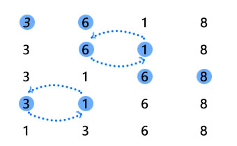
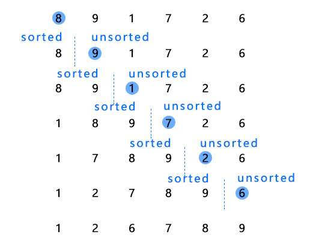
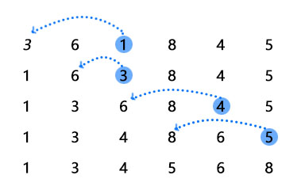
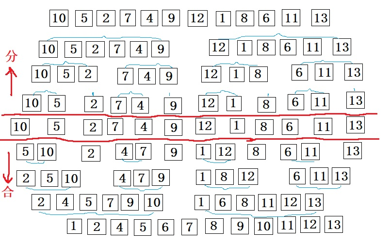
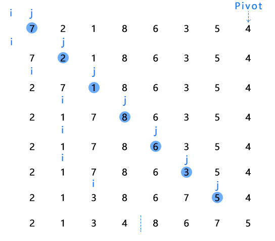

针对集合排序，平常会很自然地使用`OrderBy`或者`OrderByDescending`方法，而排序的内部实现所体现的工程思想都很经典。各种排序的代码网上有很多，本篇就以几种排序方式为例，体会其中的迭代思想、二分思想、分治思想。

**迭代思想**

迭代思想就像爬楼梯，一个一个楼梯往上爬。最能体现迭代思想的是冒泡排序(Bubble Sort)。

以上，每次循环遍历都是从起始位置开始，一个位置都不漏地比较大小、交换位置，直到"冒泡"出一个最大值放在最右边。

**二分思想**

上帝把人类分成了男人和女人，在插入排序(Insertion Sort)和选择排序(Selection Sort)中，把数据分成了已排序和未排序这两部分。

以上是**插入排序**。左边存放已排序数据，右边存放未排序数据。每次都会从未排序数据中拿到一个数据，先和左边的数据比较大小，然后插入到合适的位置，最后该位置后面的所有数据都向后移动一位。

以上的**选择排序**和插入排序相同的是，都把数据分成了已排序和未排序两部分，左边存放已排序数据，右边存放未排序数据。但和插入排序不同的是，每次从未排序部分拿数据会选择最小的那个，然后与已排序部分的最后一个比较，如果比该数小就交换位置。

**分治思想**

所谓分治思想就是分而治之，把一个大问题不断地切分成更小的问题，当把每个小问题解决掉后，也就解决了大问题。体现分治思想的排序有归并排序(Merge Sort)、快速排序(Quick Sort)、桶排序(Bucket Sort)、计数排序(Counting Sort)、基数排序(Radix Sort)。

以上是**归并排序**。首先把数据不断的拆分成更小的单元，直到递归到无法拆分就排序，接着把所有拆分的单元进行合并最终得到排序结果。

以上的**快速排序**中，首先会选择一个元素作为Pivot,比Pivot元素小的放在Pivot的左边，否则放在其右边，Pivot放在中间位置。就这样，通过选择Pivot的方式，把数据不断拆分排序递归，最终拿到排序结果。

**桶排序**通常会用在把一个大数据分解成更小的数据交给内存处理。假设有20G的订单数据需要排序，为了缓解内存的压力，就把不同范围内的数据放在不同的桶中，比如0-1000元的订单放在第1个桶，1001-2000元的订单放在第二个桶，以此类推。这样，当把每个桶依次加载到内存进行排序完后，所有的排序工作也就完成了。当然，这里有可能会出现某个桶内的数据依然很大，这时候还可以通过把这个桶的数据分装在多个子桶里来解决。桶排序和归并排序、快速排序的不同之处在于分治的粒度不一样，桶排序根据实际情况来决定拆分成多少份，而归并排序、快速排序则拆分到最小单元处理问题。

**计数排序**是桶排序的特例。比如，需要对一百万考生进行排名，最低分是0分，最高分是100分。可以拿出101个桶，然后把所有相同分数的人放在对应的桶中，只需要记下桶内的人数，排名自然容易算出。

**基数排序**也体现了分治思想。比如，给50万个手机号码进行排序，可以一个位一个位地排序，从最右边的位开始，一直到最高位，经过11次排序，排序结果就出来了。

**如何判断排序方法的好坏**

评价一个算法的好坏，从时间的维度可以用时间复杂度，从空间的维度可以用空间复杂度。通常可以把高阶、系数和常数忽略，但当数据量很小的时候，这三个方面也需要纳入考虑。

一个排序算法的好坏，除了以上的判断标准，还可以从稳定度、顺序度/逆序度、交换次数来判断。另外，考虑到排序之前的数据有序度的不同，最差情况时间复杂度、平均情况时间复杂度、最好情况时间复杂度也是判断排序算法好坏的标尺。

