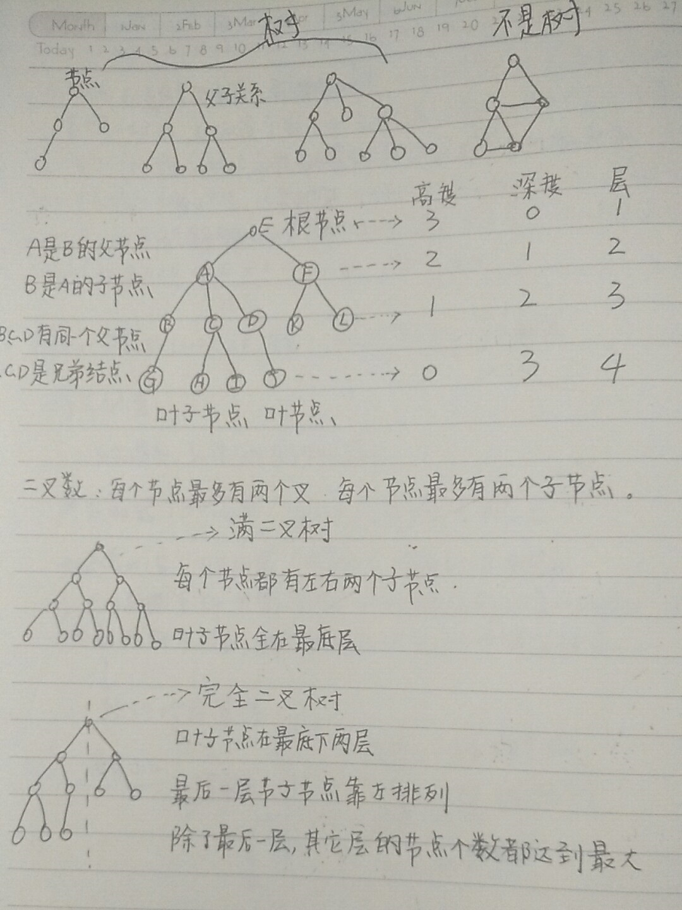
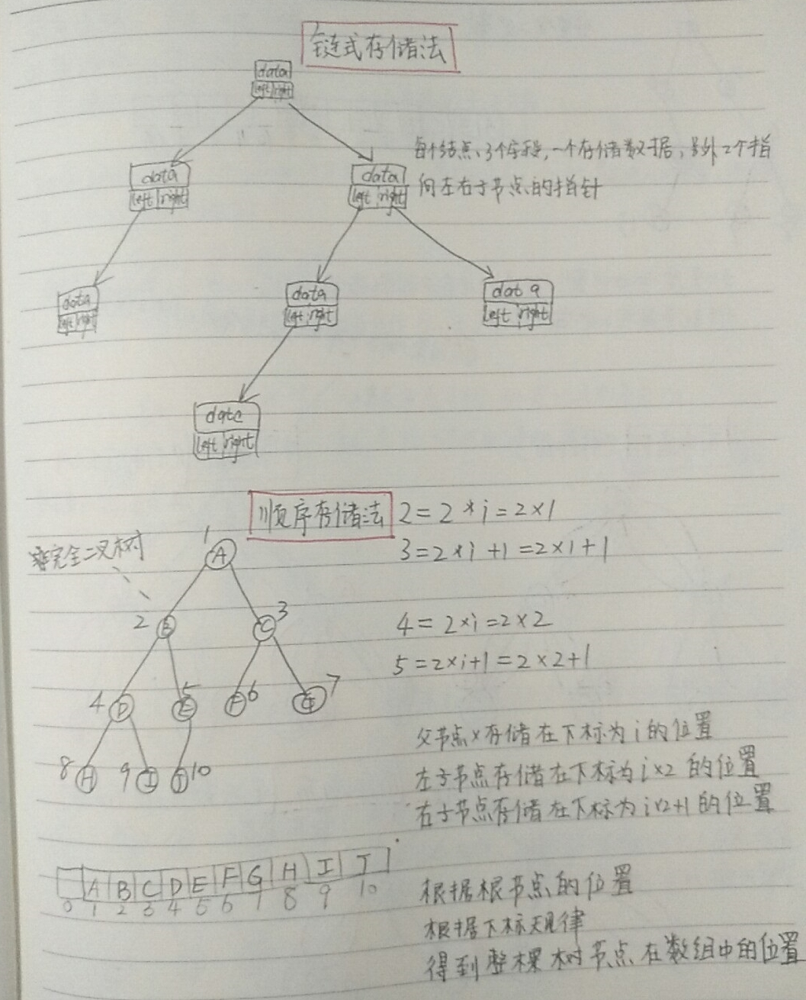
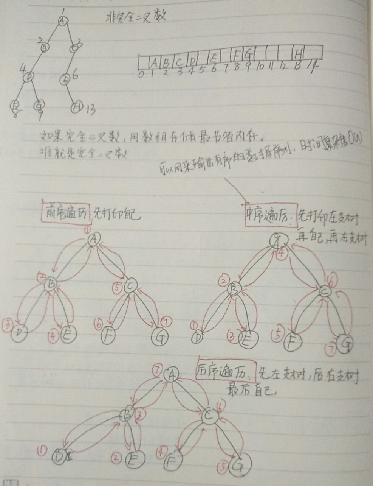
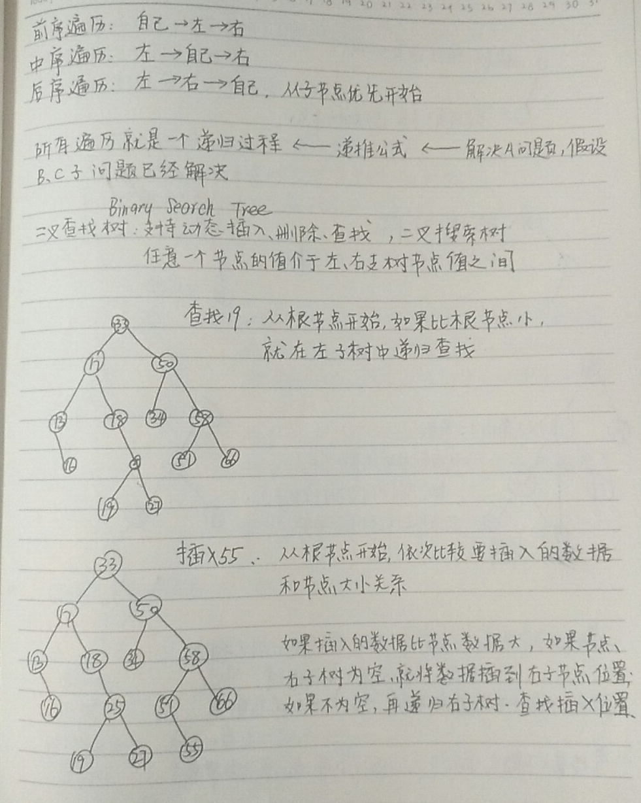
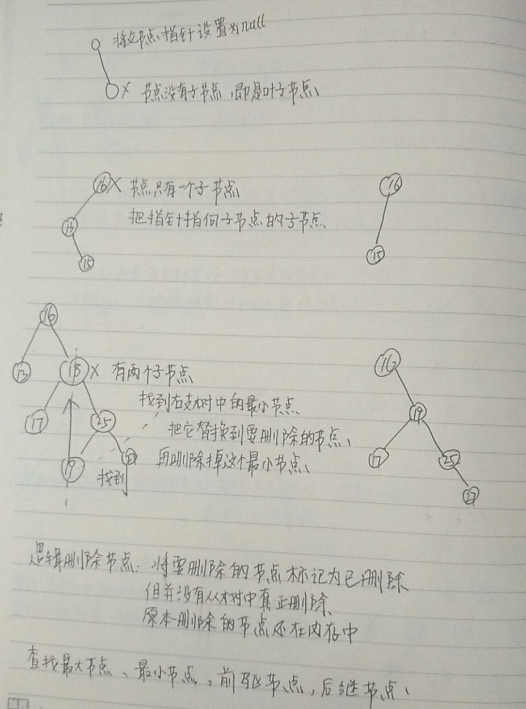

首先是树的概念，其中高度是从叶子节点开始的，深度是从根节点开始的，两者标号都从零开始。层是从根节点开始的，层标号是从1开始的。

树的存储有“链式存储”、“顺序存储”。

树遍历的三种方式：前序遍历、中序遍历、后序遍历。所有的遍历可以看作是一个递归的过程，有递归就有归纳的递推公式，想解决问题A的假设前提是B和C的子问题已经解决。

二叉树的定义，二叉树的查找和插入。

二叉树的删除需要考虑是否有子节点，有几个子节点。

实际情况下，二叉树会存储包含很多字段的对象，把对象的某个字段作为key,对象的其它字段叫卫星数据。会出现存储的两个对象的键相同，以下是冲突解决的方式，以及二叉查找书和散列表的对比。

