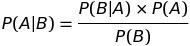
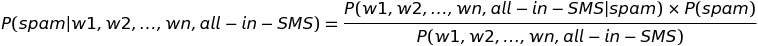
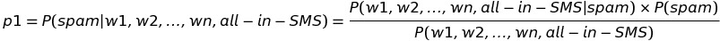
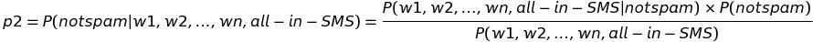

> 如何屏蔽骚扰电话？

假设每个电话号码16个字节，如果有50万个电话号码，需要多少内存空间呢？16 * 50 0000 = 8 * 106，大概在10M。那就把黑名单做到本地的散列表、二叉树、或者布隆过滤器都可以。

> 如果黑名单有500万个，如何做呢？

如果用散列表、二叉树、或者布隆过滤器，内存消耗在100M，对一个应用程序来说太大了。可以使用位图，500万个黑名单内手机号码，就是500万个二进制位， 500 0000 / 8 = 6 * 106，大概在7MB左右，这还不错。

> 如何屏蔽垃圾短信呢？

一种思路是基于规则。针对非法单词、群发号码、短信中包含回拨信息、短信模板定义出一个规则来。

需要解决的一个问题是分词。分词需要大量样本，哪些单词最常出现在垃圾短信中，做好标记。大致过程：

- 分词，去掉没有意义的词，得到n个不同单词
- 有多少条垃圾短信出现过某个单词
- 有多少条非垃圾短信出现过某个单词
- 计算每个单词出现在垃圾短信中的概率
- 计算每个单词出现在非垃圾短信中的概率
- 如果出现在垃圾短信中的概率大于或者远远大于出现在非垃圾短信中的概率，那这个词是垃圾短信

规则做法的好处是简单直接，但是也很主观，并且有意者可以编辑原本非法的内容使之符合规则。

## 朴素贝叶斯算法

来一个简单例子。统计10天内上学和下雨的数据。

|晴天| 晴天 | 下雨 | 晴天 | 下雨 | 晴天  | 晴天 | 下雨 | 晴天 | 下雨 |
|---|---|---|---|---| --- |---|---|---|---|
| 上学 | 没上 |上学  |上学  | 没上 | 上学  |  上学| 没上 |  上学| 上学 |

- 下雨的概率：P(B)=4/10
- 不上学的概率： P(A)=3/10
- 下雨天不上学的概率：P(A|B)=2/4
- 不上学中下雨的概率：P(B|A)=2/3

这个几个概率间的关系就是朴素贝叶斯算法：

基于朴素贝叶斯设计过滤器的步骤大致是：

- 需要基于短信内容判断是否是垃圾短信
- 需要把短信抽象成计算机可以理解的特征项
- 分词，把一条短信分割成n个单词
- 这n个单词就是特征项
- 现在要判断同时出现这n个单词或者叫特征项的短信是否是垃圾短信，注意这里和规则过滤就不一样了，规则过滤是非黑即白，而这里玩的是概率
- 也就是求解：P(短信是垃圾短息|w1, w2, ..., wn同时出现在一条短信)
- 是不是可以这样做呢？统计单词中同时包含w1, w2, ..., wn的有y条，其中的垃圾短信有y条，是不是可以通过y/x求出呢？这样做是不对的，一是样本中数量是有限的，二是实际情况下很少或者没有这种几个单词同时出现在一条短信中的情况

转换成朴素贝叶斯算法就是：

P(w1, w2, ..., wn, all-in-SMS|spam)如何计算呢？

独立事件发生的概率有这么一条公式：

P(A*B)=P(A)*P(B)

所以，P(w1, w2, ..., wn, all-in-SMS|spam)就可以等价成：P(w1|spam)*P(w2|spam)...*P(wk|spam)。

P(spam)短信是垃圾短信在样本中的概率如何求呢？通过样本中垃圾短信的个数/样本短信总数。

而P(w1, w2, ..., wn, all-in-SMS)无法通过样本数据得到，应为样本数据是有限的。

可以避之转换思路，如果分别求出短信是垃圾短信的概率P1，以及短信是非垃圾短信的概率p2,如果p1大于p2或者p1远远大于p2,那这条短信是垃圾短信的概率就比较高。

也就是：

