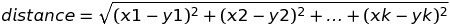

觉得向量空间的解决方式还是很神奇，把原本把港仔打不到边的事放在空间里解决。

> 音乐播放软件如何向用户推荐歌曲呢？

有两种思路：

- 把其它相似用户喜欢的歌曲推荐
- 把歌曲的其它相似歌曲推荐

如果能把歌曲特征化、数字化成这样：

| | 歌曲1 |歌曲2|歌曲3|歌曲4|歌曲5|歌曲6|歌曲7|歌曲8|歌曲9|歌曲10|
| ---| ---|---|---|---|---|---|---|---|---|---|
|你|1|1|1|0|0|1|1|1|0|0|
|用户B|1|1|1|0|0|1|1|0|1|0|
|用户C|0|0|1|1|0|1|0|0|0|1|

- 遍历每个用户
- 每个用户是否也喜欢你喜欢的歌呢？
- 如果共同喜欢的歌数量超过某个阈值
- 就把该用户喜欢的歌同样推荐给你

但在实际中没有明确的数值可以比较，一个用户是否喜欢歌曲和用户的很多行为有关，比如：

- 单曲循环：5分
- 分享：4分
- 搜索：2分
- 听完：1分
- 没听：0分
- 跳过：-1分

综合考虑这些行为，就得到了如下的表：
| | 歌曲1 |歌曲2|歌曲3|歌曲4|歌曲5|歌曲6|歌曲7|歌曲8|歌曲9|歌曲10|
| ---| ---|---|---|---|---|---|---|---|---|---|
|你|5|3|3|0|-1|2|5|4|1|-1|
|用户B|4|5|2|1|0|3|2|0|1|1|
|用户C|1|0|5|5|-1|5|0|0|0|2|

如何计算两个用户喜欢歌曲的相似度呢？

要看下向量vector的概念。一维空间的两个点用1和2表示，二维空间的两个点用(1,3)和(4,2)表示，三维空间的两个点用(1,3,5)和(3,1,7)，这就是多维空间下向量的表示方法。而欧几里得(Euclideam distance)求得是两个向量之间的距离,公式为：

**神奇时刻出现了!Magic Moment!**

**把每个用户对歌曲的喜欢程度用向量表示，欧几里得距离越近，就越相似。**

如果一开始冷启动还没有很多用户呢？那估计只能基于歌曲的相似度来推荐了。比如你喜欢伤感歌曲，就给你推荐其它伤感歌曲。这需要人工对很多歌曲进行标注，并且具有主观性，这种方式不好。

上面是把用户喜欢的不同歌曲作为向量。现在可以把歌曲被不同用户喜欢作为向量，欧几里得距离越短，相应的歌曲越值得推荐。

| | 用户A | 用户B | 用户C|
|---|---|---|---|
| 歌曲1| 5 | 3 | 0|
| 歌曲2| 5 | 2 | -1|
| 歌曲3| 3 | 1 | 0|

以上就是推荐系统Recommendation System中的基本思路。

