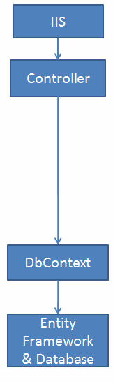
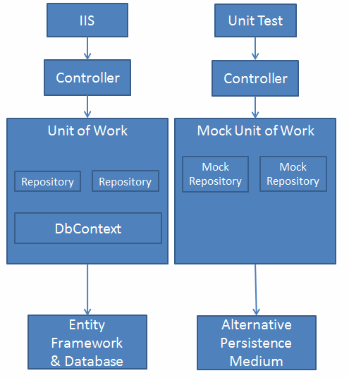

在刚开始接触ASP.NET时候，使用Repository层已经是一个根深蒂固的习惯了。但随着 .NET Core和Entity Framwork Core的发展以及多年实践，很多人都觉得Repository层其实没有必要，因为EF Core本身自带Repository和Unit of Work属性。为什么现在不需要Repository层，以及去Repository层后是如何实现呢？

时间往前推到2013年左右，当时使用MVC和Entity Framwork已经是主流，起先大概是这样的：



以上，DbContext和Controller之间是强耦合，并且不方便单元测试，于是Repository层出现。



开发者在使用Repository层的时候发现了一些缺点，其中一个缺点是处理实体间关系时性能不佳。

比如有这样的两个类：

```
public class Student
{
    public Address Address{get;set;}
}

public class Address{}
```

当在repository层获取Student实例时，Entity Framwork默认使用Lazy Loading机制，就是只要程序代码不去获取Student的Address属性就不会主动加载Student.Address属性。关于Lazy Loading举例如下：

```
using(var ctx = new SchoolDBEntities())
{
    IList<Student> stus = ctx.Students.ToList<Student>();
    Student std = stus[0];
    StudentAddress add = std.Address;
}
```

当获取Student集合的时候，背后会执行一次SQL语句，当获取Student的Address属性的时候，背后会再次执行SQL语句。


