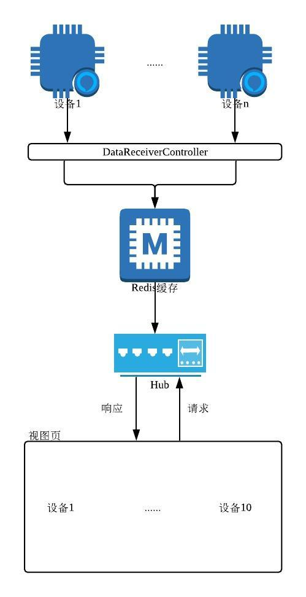
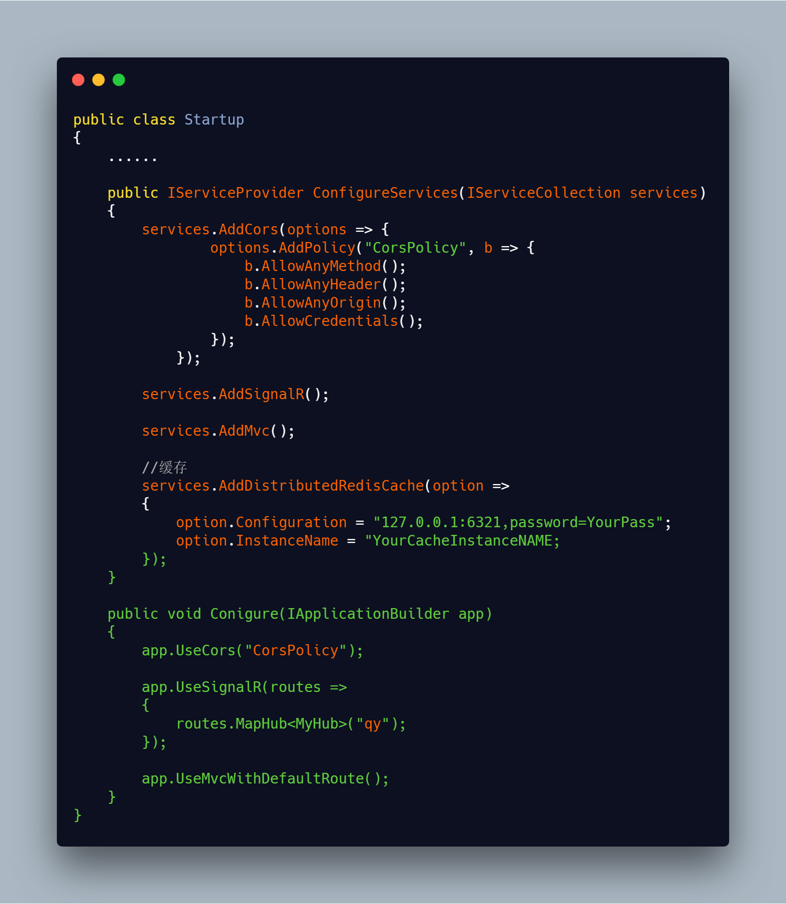
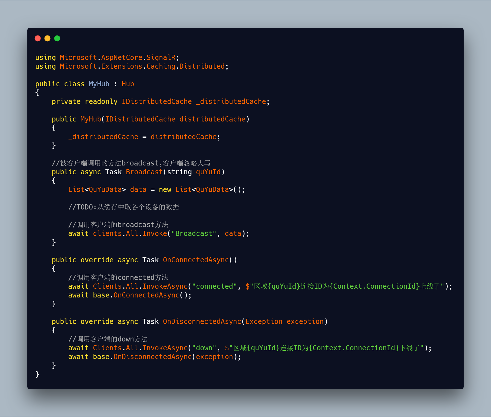
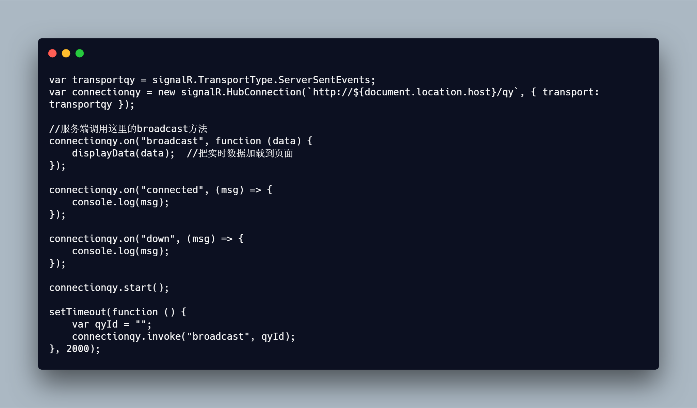
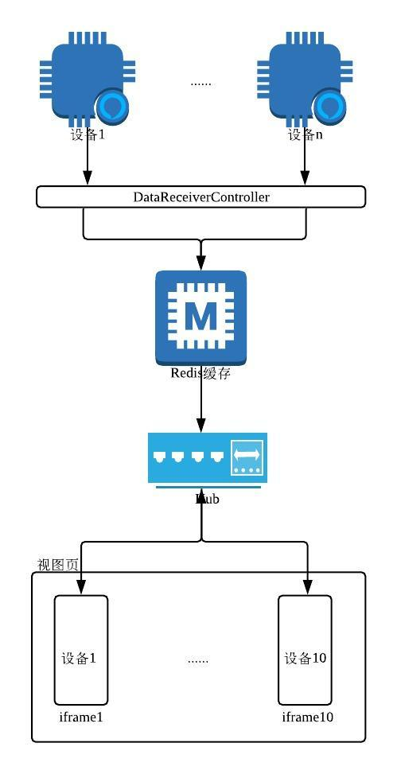
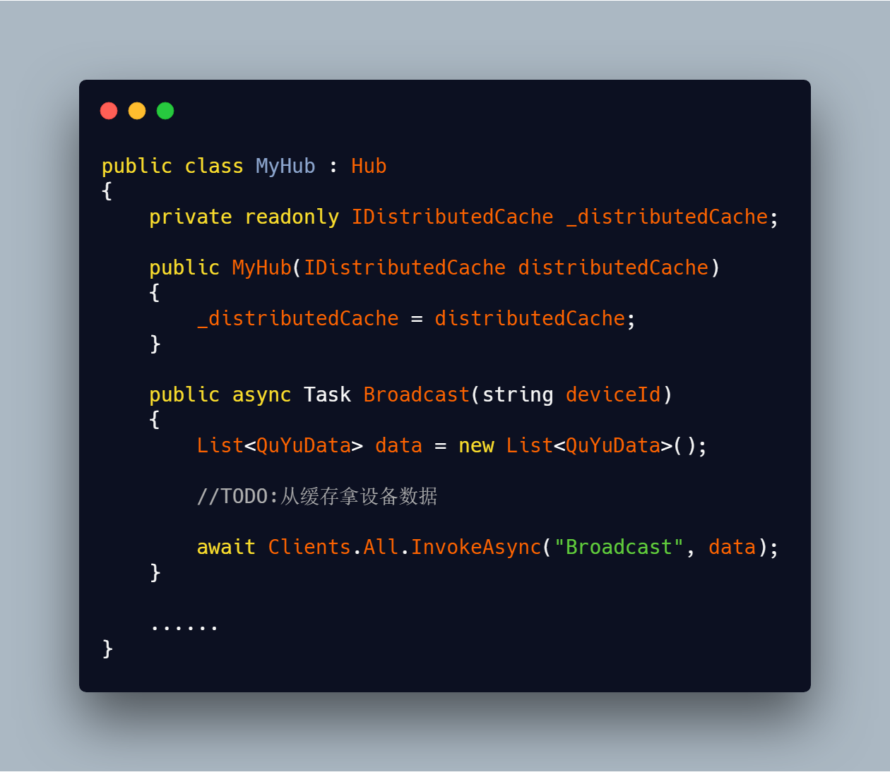
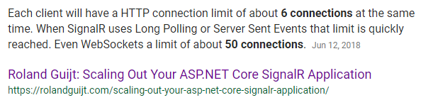
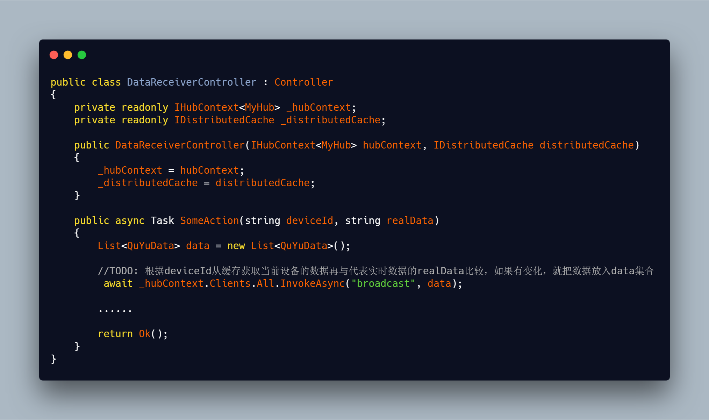
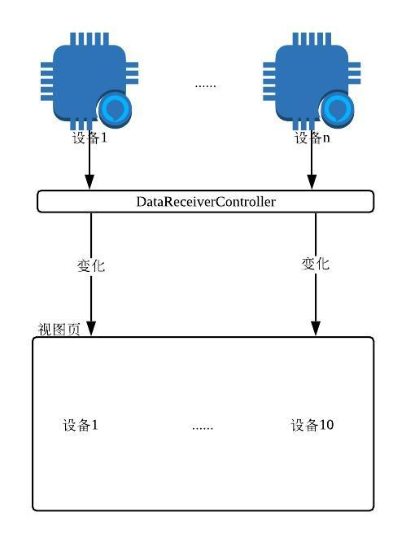

多数情况下，客户端和服务端的关系就像一对朋友，通过请求--响应方式你来我往，客户端无论是刷新页面还是发送请求，服务端有求必应。[SignalR](https://dotnet.microsoft.com/apps/aspnet/real-time)让客户端和服务端之间建立了全双工通讯，两者又似乎成了家人，你中有我我中有你，客户端可以调用服务端的方法，反之亦然。于是我们在股票金融、物联网设备、多人协作等需要实时显示数据的场景中看到了SignalR的身影。

本周，在"青岛微软技术交流"群里，Darren提出了一个SinglaR连接数受限的问题，经过大家的群(七)策(嘴)群(八)力(舌)，Darren最终在项目中避开了连接数限制问题，取得了很好的实时效果。本篇侧重于对整个过程的复盘，不涉及SignalR的基本面。

在Darren的项目中，设备的实时数据指向到了MVC中的一个控制器(DataReceiverController)方法，局域网内的设备每隔几秒向该控制器方法发送实时数据一次，在其中进行处理并按设备号(设备号具备唯一性)异步保存到Redis缓存，最终在视图页中展示某个区域的、比如10台设备的实时数据。

首先的一个思路是：当打开某个区域内包含10台设备的视图页，让它每隔几秒就到Hub取数据，而Hub负责把Redis缓冲中的各个设备的数据收集上来转换成视图页所需要的格式。大致如下：

这样做能实现实时性，但是存在的问题是：**由于每个设备中包含了多路数据，当设备中的某个线路数据发生变化，视图页需较长的时间才能反应过来。**

代码方面，在依赖倒置容器、请求管道中的配置大致如下：

以上的`MyHub`是SignalR中最核心的部分。

有了Hub,视图页就每隔几秒向Hub请求一次。

以上，视图页每次向Hub请求数据，Hub就会调用视图页的broadcast方法把数据加载到页面。

**既然视图页加载10台设备的所有路数据实时反应不够理想，如果分而治之会怎样呢？如果在视图页配上10个iframe，通过其src属性加载各个设备的视图页呢**？大致如下：

此时的Hub需要根据设备号到缓存取数据再交给视图页。

运行下来会报错：cannot send data if the connection is not in the 'Connected' state。原因在于：

**每个客户端将同时具有大约6个连接的HTTP连接限制。当SignalR使用长轮询或服务器发送事件时，很快就会达到限制。甚至WebSockets也限制了大约50个连接**。

于是Darren把问题抛给了群里。有说可以通过Stream的方式来做，也有从设备通讯协议的角度给出建议。最后，"独火"建议只把数据变化交给客户端，Darren尝试了这种方式。

SignalR提供了`IHubContext<T>`接口，可以把它注入到控制器，每当设备数据过来，把现有数据和缓存中的数据进行比对，如果有变化直接使用`IHubContext<T>`调用视图页方法。

这样一来，在`DataReceiverController`中获取到实时数据，与缓存数据进行比对，只把变化交给视图页。用这种方式实时反应明显提升，并且避开了SignalR连接数限制的问题。

以上 .NET Core的运行时是2.0，各个运行时下使用SingalR的方式略有不同。

**感谢"青岛微软技术交流"群每个伙伴的参与和分享**！

